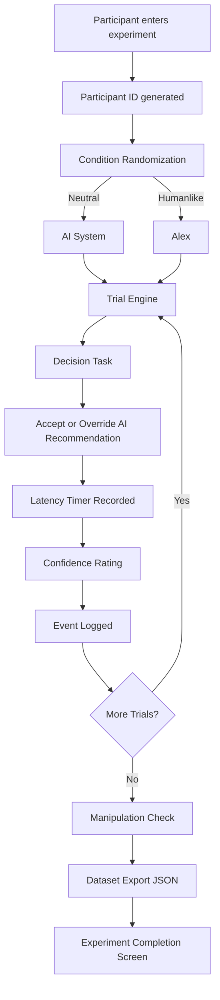

# Project Overview

This project is a lightweight experimental platform designed to study
**human trust in AI-assisted decision systems**.

The system allows researchers to manipulate interface cues such as AI
naming and presentation style and measure how these cues influence user
decisions, reliance on AI recommendations, and behavioral trust.

The platform records structured behavioral data including decisions,
response latency, and confidence ratings.

# Research Motivation

Modern AI systems increasingly use **humanlike interface cues** such as:

-   Human names

-   Conversational tone

-   Confidence framing

These cues may influence how much users trust or rely on AI
recommendations.

This experiment investigates whether users trust recommendations
differently depending on how the AI is presented.

# Experimental Design

The experiment consists of a **recommendation acceptance task**.

Participants interact with an AI assistant that recommends a product
choice.

# Experiment Flow

The following diagram shows the architecture of the experimental system
and how participant interactions are recorded.

## Experimental Conditions

| Condition | AI Label |
|----------|----------|
| Neutral | AI System |
| Humanlike | Alex |

Participants complete **5 trials** where they decide whether to:

-   Accept the AI recommendation

-   Override the AI recommendation

After each decision, the participant reports **confidence in their
choice**. The system also records **decision latency**.

At the end of the experiment, a **manipulation check** verifies whether
participants noticed the AI assistant name.

# Data Collected

Each trial generates a structured event record:

    participant_id
    trial_number
    condition
    decision
    confidence_score
    latency_ms
    ai_correct
    timestamp

The dataset is exported as:

    experiment_data.json

# Repository Structure

    ai-trust-experiment/

    frontend/
        React experiment interface

    docs/
        experiment design documentation

    data/
        sample experiment dataset

    analysis/
        analysis notebook demonstrating behavioral metrics

    README.md

# Running the Experiment

Navigate to the frontend directory:

    cd frontend
    npm install
    npm run dev

The experiment will run locally at:

    http://localhost:5173

# Analysis Notebook

A sample analysis notebook is provided in:

    analysis/trust_analysis.ipynb

The notebook demonstrates how to compute:

-   AI recommendation acceptance rate

-   Behavioral differences between conditions

-   Decision latency statistics

-   Confidence calibration

# Example Research Questions

-   Do users trust AI recommendations more when the assistant has a
    humanlike name?

-   Does perceived AI authority affect reliance decisions?

-   Are users faster to accept AI recommendations than to override them?

-   Does user confidence correlate with AI accuracy?

# Technologies Used

-   React

-   JavaScript

-   JSON data logging

-   Python (data analysis)

-   Jupyter Notebook

# Broader Impact

This project contributes to **responsible AI design** by helping
researchers understand:

-   How interface design influences trust

-   When users overtrust AI systems

-   How to design AI assistants that support better decision making

# Author

**Om Pradip Chougule**

Artificial Intelligence and Machine Learning Student

KIT's College of Engineering

GitHub: <https://github.com/ironman1947>

LinkedIn: <https://linkedin.com/in/om-chougule-2471312b5>
